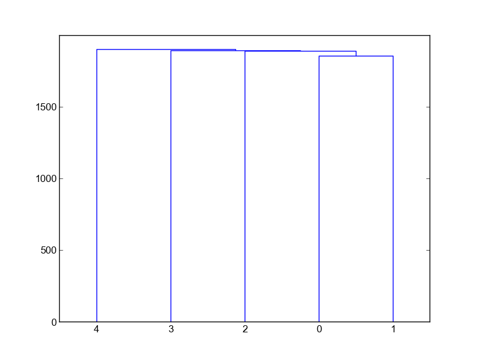

# Assignment 2 - Logistic Regression
- Miles Curry **(currymi)**, Christian Armatas **(armatasc)**
- CS434
- Dr. Xiaoli Fern
- Spring 2017


# Running the Code
The code runs a python 2 so it should be simple to run and requires pip
to make sure you have the packages we use installed.
1. First install the requirements using pip
'''
pip install -r requirements
'''
2. Run our implementation by running the following (pass the -v or --verbose flag to produce verbose output)
'''
python logRegress.py -v 2 # This will determine the learning rate!
'''

If you have any questions or problems, let us know. Thanks.

# Non-Hierarchical Clustering

## 1. SSE K = 2 Vs Iterations

Here is our plot of our SSE values vs the number of iterations.


## 2. SSE k = 2-10 Vs 10 Iterations

Here is our plot of the SSE values vs the number of iterations at different
values of k. The lowest SSE value we recorded was: ``8652667``.

Based on our graph we would choose ``k = 8, 9, 10`` as they seemed to have
the lowest SSE 'elbow.'

# Hierarchical Agglomerative Clustering (HAC)

## Single

 

```
Merged cluster: 42 with cluster: 2 with distance: 1856.46572821
Merged cluster: 43 with cluster: 2 with distance: 1890.6067809
Merged cluster: 28 with cluster: 8 with distance: 1894.06995647
Merged cluster: 10 with cluster: 5 with distance: 1902.73671326
Merged cluster: 8 with cluster: 5 with distance: 1911.37463622
Merged cluster: 29 with cluster: 4 with distance: 1949.99102562
Merged cluster: 32 with cluster: 4 with distance: 1970.68236913
Merged cluster: 27 with cluster: 1 with distance: 1976.6580382
Merged cluster: 35 with cluster: 1 with distance: 1990.49667169
Merged cluster: 26 with cluster: 1 with distance: 2052.56181393
```
Here we reported our clusters being merged. We were able to merge clusters and
calculate the distances, however we're not sure on the cluster numbers as they
sometimes appear to be the same cluster, but we're not sure if they are or not.
However, we know the distances between the clusters are correct!


## Complete

 

```
Merged cluster: 28 with cluster: 6 with distance: 2323.28969352
Merged cluster: 26 with cluster: 5 with distance: 2322.24288135
Merged cluster: 25 with cluster: 4 with distance: 2317.57826189
Merged cluster: 25 with cluster: 6 with distance: 2294.40863841
Merged cluster: 24 with cluster: 7 with distance: 2263.83413703
Merged cluster: 22 with cluster: 6 with distance: 2235.52477061
Merged cluster: 18 with cluster: 5 with distance: 2209.47459818
Merged cluster: 20 with cluster: 2 with distance: 2152.18888576
Merged cluster: 21 with cluster: 3 with distance: 2114.71440152
Merged cluster: 0 with cluster: 2 with distance: 1295.42850054
```

Similarly to single HAC we know the distances are correct!
