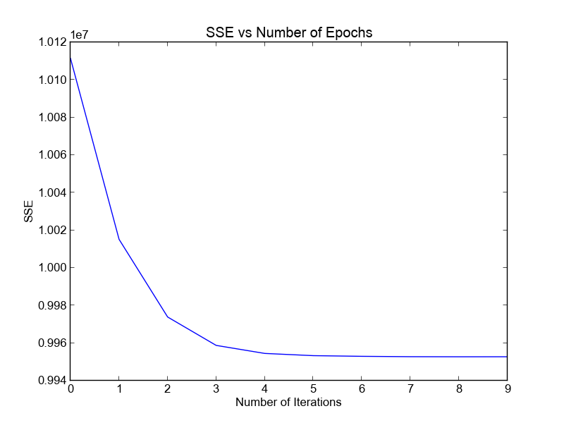

# Assignment 2 - Logistic Regression
- Miles Curry **(currymi)**, Christian Armatas **(armatasc)**
- CS434
- Dr. Xiaoli Fern
- Spring 2017

# Running the Code
The code runs a python 2 so it should be simple to run and requires pip
to make sure you have the packages we use installed.
1. First install the requirements using pip
'''
pip install -r requirements
'''
2. Run our implementation by running the following (pass the -v or --verbose flag to produce verbose output)
'''
python logRegress.py -v 2 # This will determine the learning rate!
'''

If you have any questions or problems, let us know. Thanks.

# Non-Hierarchical Clustering

## 1. SSE K = 2 Vs Iterations

Here is our plot of our SSE values vs the number of iterations.

## 2. SSE k = 2-10 Vs 10 Iterations

Here is our plot of the SSE values vs the number of iterations at different
values of k. The lowest SSE value we recorded was: ``8652667``.

Based on our graph we would choose ``k = 8`` or ``k = 9`` as they seemed to have
the lowest SSE 'elbow.'

# Hierarchical Agglomerative Clustering (HAC)

